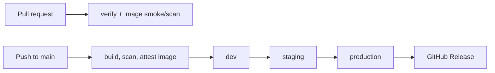

# Helgefolelse

A small website that shows how close it feels to the weekend. The reading rises from Monday to Friday at 16:00, stays at 100 through Saturday, and falls on Sunday. All times are interpreted in `Europe/Oslo`.

## Getting started

Install Node.js 24 or newer and enable pnpm through Corepack. The repository pins the pnpm version in `package.json`.

```sh
corepack enable pnpm
pnpm install
pnpm dev
```

Open [http://localhost:3000](http://localhost:3000). Run commands from the repository root unless noted otherwise.

## Commands

| Command                 | Purpose                           |
| ----------------------- | --------------------------------- |
| `pnpm dev`              | Start the development server      |
| `pnpm build`            | Build the web app for production  |
| `pnpm lint`             | Run ESLint                        |
| `pnpm lint:workflows`   | Check GitHub Actions workflows    |
| `pnpm typecheck`        | Run TypeScript checks             |
| `pnpm test`             | Run app unit tests                |
| `pnpm format:check`     | Check formatting for CI           |
| `pnpm format`           | Format supported files            |
| `pnpm --filter web dev` | Run only the web app's dev script |

The root scripts use Turborepo to run tasks across workspaces. Currently there is one app, `web`; there are no shared packages or separate backend yet. For the local workflow lint command on macOS, install actionlint with `brew install actionlint`. CI installs a pinned actionlint version separately.

Smoke tests live in the web app and check a running server's health, commit SHA, and home page. They use Node's built-in test runner, so CI and deployment need no dependency install to run them:

```sh
SMOKE_URL=http://localhost:8080 SHA="$(git rev-parse HEAD)" pnpm --filter web test:smoke
```

Start the server or container with the same `GIT_SHA`. Unit tests run separately and do not require a server.

## Local image security scan

The delivery workflow scans the production image with Trivy before publishing it. To run the same scan locally on macOS, install [Trivy](https://trivy.dev/latest/getting-started/installation/) and make sure Docker is running:

```sh
brew install trivy
docker build --pull -f apps/web/Dockerfile -t helgefolelse-web:local .
trivy image \
	--scanners vuln,secret \
	--severity HIGH,CRITICAL \
	--ignore-unfixed \
	--exit-code 1 \
	helgefolelse-web:local
```

The command exits with status `1` when a HIGH or CRITICAL finding with an available fix is detected. Advisories without a published fix are reported but ignored, matching CI. Trivy downloads its vulnerability database on the first scan; use `trivy image --download-db-only` to update it separately.

## Delivery

Two workflows, no helper scripts:



- **CI/CD** (`ci-cd.yml`) checks PRs and merge-queue groups (lint, types, tests, Terraform validate/test, Trivy, actionlint, zizmor). On `main` it publishes one image to GHCR, scans and attests that digest, then promotes the same digest through `dev`, `staging` and `production`. Staging and production wait for a reviewer.
- **Deploy** (`deploy.yml`) is called once per environment, or manually to redeploy/roll back. One job:
  1. Resolves the release (commit SHA or tag) to its GHCR digest and verifies the attestation was signed by `ci-cd.yml` on `main`.
  2. Runs `terraform apply` for that environment, so infrastructure and app move through the environments together.
  3. Mirrors the image to the environment's Artifact Registry (digest preserved), deploys a zero-traffic `candidate` revision, smoke tests it, then shifts 100% traffic. A failed smoke test leaves traffic unchanged.
  4. Tags the GHCR image with the environment name.

To roll back, run **Deploy** on `main` with the environment and an older commit SHA or release tag (`vYYYY.M.<run>`).

Terraform owns infrastructure; the workflow owns image, revisions and traffic. See [infra/README.md](infra/README.md).

## Structure

- `apps/web/src/app/` - Next.js routes, layout, and the tide visualization.
- `apps/web/src/lib/` - the weekend calculation and display copy.
- `infra/` - Terraform for each GCP environment (`environments/*.tfvars`) and `infra/github/` for GitHub environments.
- `pnpm-workspace.yaml` - workspace membership and dependency build settings.
- `turbo.json` - task orchestration and build caching.

This repository uses pnpm workspaces. Add app dependencies with `pnpm --filter web add <package>` and commit changes to `pnpm-lock.yaml`. Use pnpm rather than npm or Yarn so the lockfile stays consistent.
